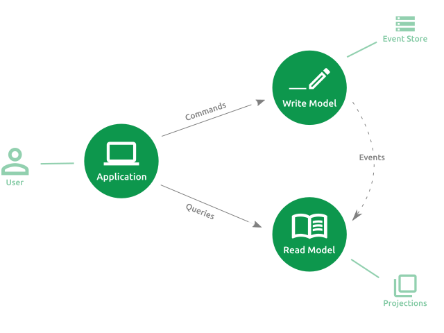

<h1 align="center">
    CQRS and Event Sourcing Example
</h1>

<p align="center">
    <a href="https://codeclimate.com/github/renan-taranto/cqrs-event-sourcing-example/maintainability"></a>
    <a href="#" align="center"></a>
    <a href="#" align="center"></a>
    <a href="#" align="center"></a>
    <a href="#" align="center"></a>
    <a href="#" align="center"></a>
    <a href="#" align="center"></a>
</p>

<p align="center">
    This project showcases a list-making Web API using Hexagonal Architecture, CQRS, Event Sourcing and DDD.
</p>

<p align="center">
  
</p>

<p align="center"><b>Featuring</b></p>
<p align="center">
	Aggregates, Value Objects, Domain Events and other DDD building blocks
    </br>
    Eventual Consistency
    </br>
    All sorts of tests: unit, integration, functional and acceptance with BDD
    </br>
    PHP and Symfony Framework
    </br>
</p>

<p align="center">
    <a href="#table-of-contents">Read the docs</a>
</p>

## Table of contents
* [Usage](#usage)
  * [Requirements](#requirements)
  * [Installation](#installation)
  * [Starting the application](#starting-the-application)
  * [Documentation](#documentation)
    * [Swagger](#swagger)
    * [Quick Start](#quick-start)
  * [Testing](#testing)
* [Application Design](#application-design)
  * [File Structure](#file-structure)
  * [Hexagonal Architecture](#hexagonal-architecture)
    * [User Interface](#user-interface-also-called-presentation)
      * [CommandController](#commandcontroller)
      * [QueryController](#querycontroller)
    * [Application](#application)
      * [Commands](#commands)
      * [Queries](#queries)
      * [Finders](#finders)
      * [Validation](#validation)
    * [Domain](#domain)
      * [Aggregates](#aggregates)
      * [Repositories](#repositories)
      * [Value Objects](#value-objects)
    * [Infrastructure](#infrastructure)
      * [Repository](#repository)
      * [Event Store](#event-store)
      * [Projector](#projector)
  * [CQRS](#cqrs)
    * [Message Buses](#message-buses)
    * [Eventual Consistency](#eventual-consistency)
    * [Projections](#projections)
* [Inspiration](#inspiration)
* [Author](#author)

## Usage

### Requirements
Install [Docker](https://www.docker.com/get-started) and [Docker Compose](https://docs.docker.com/compose/install/).

### Installation
1. Clone the repository:

`$ git clone git@github.com:renan-taranto/cqrs-event-sourcing-example.git`

2. Move to the project directory:

`$ cd cqrs-event-sourcing-example`

3. Build the containers and install dependencies with:

`$ make install`

### Starting the application

Run:

`$ make start`

It will run on port 80, check the [Documentation](#documentation) section to know how to use it.

### Documentation

##### Swagger

Swagger UI is available at [/doc](http://127.0.0.1/doc/). It describes how all endpoints works.

##### Quick start

1. Create a board by sending a `POST` request to [/boards](http://127.0.0.1/boards)
```yaml
# POST http://127.0.0.1/boards
{
  "id": "c439b9ba-b8f2-47c0-b369-872214668d7d",
  "title": "Kanban"
}
```
> IDs are Version 4 UUIDs. In order to test the API manually, you can generate them at https://www.uuidgenerator.net/version4.

2. Add a list to the board with a `POST` request to [/lists](http://127.0.0.1/lists)
```yaml
# POST http://127.0.0.1/lists
{
  "id": "71340b94-c02f-4bef-9989-9486d68cf28e",
  "title": "To Do",
  "boardId": "c439b9ba-b8f2-47c0-b369-872214668d7d"
}
```

3. Add an item to the list with a `POST` request to [/items](http://127.0.0.1/items)
```yaml
# POST http://127.0.0.1/items
{
  "id": "e1620255-88bf-4f0b-9793-4cc35e2513d7",
  "title": "[Feature] Item Labels",
  "listId": "71340b94-c02f-4bef-9989-9486d68cf28e"
}
```

4. See the result with a `GET` request to [/boards/c439b9ba-b8f2-47c0-b369-872214668d7d](http://127.0.0.1/boards/c439b9ba-b8f2-47c0-b369-872214668d7d)
```yaml
# GET http://127.0.0.1/boards/c439b9ba-b8f2-47c0-b369-872214668d7d
{
  "id": "c439b9ba-b8f2-47c0-b369-872214668d7d",
  "title": "Kanban",
  "open": true,
  "lists": [
    {
      "id": "71340b94-c02f-4bef-9989-9486d68cf28e",
      "title": "To Do",
      "items": [
        {
          "id": "e1620255-88bf-4f0b-9793-4cc35e2513d7",
          "title": "[Feature] Item Labels",
          "description": ""
        }
      ],
      "archivedItems": []
    }
  ],
  "archivedLists": []
}
```

Many other endpoints are available. Check the Swagger UI at http://127.0.0.1/doc/ to learn more.

### Testing

Run all test suites:

`$ make test-all`

Generate a code coverage report:

`$ make test-coverage`

The report can be found at "tests/etc/_output/coverage".

Each test suite can also be executed separately:

`$ make test-unit`

`$ make test-integration`

`$ make test-functional`

`$ make test-api`

## Application Design

This section is about the project's patterns and design.

### File Structure

Source code files are grouped by feature:
- src
  - Board
    - Application
    - Domain
    - Infrastructure
  - Item
    - Application
    - Domain
    - Infrastructure
  - ...
 
There's also the `Shared` namespace that stores the user interface layer (which is decoupled from all features) and components like the event store. 

### Hexagonal Architecture

This topic explains how the most relevant components of each layer in the hexagonal architecture works and how they relate to each other.
The layers will be presented in the *Flow of Control* order, from the *User Interface* to the *Infrastructure*, passing through 
the *Application* and the *Domain*.

##### User Interface (also called "Presentation")

In the User Interface layer there are two web controllers used by the outside world to "drive" the application: 
[CommandController](https://github.com/renan-taranto/cqrs-event-sourcing-example/blob/master/src/Shared/Ui/Web/Controller/CommandController.php) 
and [QueryController](https://github.com/renan-taranto/cqrs-event-sourcing-example/blob/master/src/Shared/Ui/Web/Controller/QueryController.php). 
These are called *Primary* or *Driving Adapters* in the hexagonal architecture context.

###### CommandController
   
The write model web controller. It deserializes HTTP requests into commands and dispatches them using the *command bus*.

This single class is able to dispatch all existing commands, so no other controller is needed for the write model.
That's done by declaring the command class 
associated to the route in the `command_class` route attribute:

```yaml
# config/routes/board.yml
command::create-board:
    path: /
    methods: POST
    defaults:
        _controller: Taranto\ListMaker\Shared\Ui\Web\Controller\CommandController
        _format: json
        command_class: Taranto\ListMaker\Board\Application\Command\CreateBoard
```
 
###### QueryController

The read model web controller. It uses the *query bus* to dispatch queries.

Just like the `CommandController`, this controller is able to handle all queries thanks to a route attribute. In this case the attribute
is called `query_class`:

```yaml
# config/routes/board.yml
query::boards-overview:
    path: /
    methods: GET
    defaults:
        _controller: Taranto\ListMaker\Shared\Ui\Web\Controller\QueryController
        _format: json
        query_class: Taranto\ListMaker\Board\Application\Query\BoardsOverview
```
 
##### Application

Code that drives the business core. Command and query classes can be found here alongside their handlers 
(*Primary/Driving Ports* of the application).

###### Commands

Write model use cases and their handlers. Take the `MoveItemHandler` as an example:

```php
namespace Taranto\ListMaker\Item\Application\Command;

// ...
final class MoveItemHandler
{
    private $itemRepository;

    public function __construct(ItemRepository $itemRepository)
    {
        $this->itemRepository = $itemRepository;
    }

    public function __invoke(MoveItem $command): void
    {
        $item = $this->itemRepository->get($command->aggregateId());
        if ($item === null) {
            throw ItemNotFound::withItemId($command->aggregateId());
        }

        $item->move($command->position(), $command->listId());
        $this->itemRepository->save($item);
    }
}
```

Most other handlers follows the workflow seen above:
 
1. Load the aggregate;
2. Change the aggregate by calling its methods;
3. Save the aggregate.

###### Queries

Read model use cases and their handlers. A query handler returns results by using [Finder](#finders) classes.

```php
namespace Taranto\ListMaker\Board\Application\Query;

// ...
final class BoardByIdHandler
{
    private $boardFinder;

    public function __construct(BoardFinder $boardFinder)
    {
        $this->boardFinder = $boardFinder;
    }

    public function __invoke(BoardById $query): ?array
    {
        return $this->boardFinder->byId($query->boardId());
    }
}
```

###### Finders

Finders are used by query handlers to query the *projections*. They are *Secondary/Driven Ports*, and 
their implementations (adapters) are defined in the infrastructure layer.

```php
namespace Taranto\ListMaker\Board\Application\Query\Finder;

interface BoardFinder
{
    public function openBoards(): array;

    public function closedBoards(): array;

    public function byId(string $boardId): ?array;
}
```

###### Validation

Command and query validation is done by the command bus validation middleware. 

##### Domain

The Domain layer contains the event sourced domain model. Many of the DDD building blocks like Aggregates, Repositories
 and Value Objects are used.

###### Aggregates 

Aggregate classes extends the [AggregateRoot](https://github.com/renan-taranto/cqrs-event-sourcing-example/blob/master/src/Shared/Domain/Aggregate/AggregateRoot.php),
 which provides the following methods:
```php
// src/Shared/Domain/Aggregate/AggregateRoot.php

 /**
  * Instantiates the aggregate from an event stream. For each event the "apply" method is called.
  */
 public static function reconstituteFrom(AggregateHistory $aggregateHistory): self { /* ... */ }

 /**
  * Stores an event and calls "apply".
  */
 protected function recordThat(DomainEvent $event): void { /* ... */ }

 /**
  * Changes the aggregate state according to the domain event.
  */
 protected function apply(DomainEvent $event): void { /* ... */ }

 /**
  * Pops and returns all stored events.
  */
 public function popRecordedEvents(): DomainEvents { /* ... */ }

```
When an aggregate public method like `changeTitle` is called, a domain event is created, recorded and applied. Applying an event
calls a `when` method like `whenBoardTitleChanged`:
```php
// src/Board/Domain/Board.php

    public function changeTitle(Title $title): void
    {
        // ...
        $this->recordThat(
            new BoardTitleChanged((string) $this->aggregateId, (string) $title)
        );
    }

    public function whenBoardTitleChanged(BoardTitleChanged $event): void
    {
        $this->title = $event->title();
    }
```

The project has 3 aggregates right now: `Board`, `ItemList` and `Item`. It's worth noting that `ItemList` and `Item` at
first glance should be entities belonging to the `Board` aggregate, but that would lead us to concurrence issues:
we don't want to lock the whole board when a user is working on an item, for example.  

###### Repositories
Aggregate repositories are write model repositories, so they contain only two methods: `save` and `get`.
```php
namespace Taranto\ListMaker\Board\Domain;

interface BoardRepository
{
    public function save(Board $board): void;

    public function get(BoardId $boardId): ?Board;
}
```
 
###### Value Objects

Almost all aggregate's properties are implemented as value objects. By being immutable, self-validating and meaningful,
they contribute to the creation of a strong domain model.
```php
namespace Taranto\ListMaker\Shared\Domain\ValueObject;

final class Position
{
    private $position;

    public static function fromInt(int $position): self
    {
        return new self($position);
    }

    private function __construct(int $position)
    {
        if ($position < 0) {
            throw new \InvalidArgumentException('Position must be greater than or equals 0.');
        }

        $this->position = $position;
    }

    public function toInt(): int
    {
        return $this->position;
    }

    public function equals(Position $other): bool
    {
        return $this->position === $other->position;
    }
} 
``` 

##### Infrastructure

Components that connects the core code to databases, third party tools and libraries. 

###### Repository

There is a repository implementation for each aggregate. Persistence is delegated to the [AggregateRepository](https://github.com/renan-taranto/cqrs-event-sourcing-example/blob/master/src/Shared/Infrastructure/Persistence/Repository/AggregateRepository.php). 
```php
namespace Taranto\ListMaker\Board\Infrastructure\Persistence\Repository;

// ...

final class BoardRepository implements BoardRepositoryInterface
{
    private $aggregateRepository;

    public function __construct(AggregateRepository $aggregateRepository)
    {
        $this->aggregateRepository = $aggregateRepository;
    }

    public function save(Board $board): void
    {
        $this->aggregateRepository->save($board);
    }

    public function get(BoardId $boardId): ?Board
    {
        return $this->aggregateRepository->get(Board::class, $boardId);
    }
}
```
###### Event Store

The project features a MySql event store implementation that uses Optimistic Concurrency Control to persist the events.

```php
// src/Shared/Infrastructure/Persistence/EventStore/MySqlEventStore.php

public function commit(IdentifiesAggregate $aggregateId, DomainEvents $events, AggregateVersion $expectedVersion): void
{
    try {
        $this->connection->beginTransaction();

        $this->checkForConcurrency($aggregateId, $expectedVersion);
        $this->insertDomainEvents($events, $expectedVersion);

        $this->connection->commit();
    } catch (\Exception $e) {
        $this->connection->rollBack();
        throw $e;
    }
}
  
```

The [AggregateRepository](https://github.com/renan-taranto/cqrs-event-sourcing-example/blob/master/src/Shared/Infrastructure/Persistence/Repository/AggregateRepository.php) 
uses the event store to persist the events and to reconstitute the aggregates from them.

###### Projector

Every projector extends the [Projector](https://github.com/renan-taranto/cqrs-event-sourcing-example/blob/master/src/Shared/Infrastructure/Persistence/Projection/Projector.php) 
and listens to domain events. They hold MongoDB Collection classes to persist the documents.

```php
// src/Board/Infrastructure/Persistence/Projection/BoardProjector.php

protected function projectBoardCreated(BoardCreated $event): void
{
    $this->boardsCollection->insertOne([
        'id' => (string) $event->aggregateId(),
        'title' => (string) $event->title(),
        'open' => true,
        'lists' => [],
        'archivedLists' => []
    ]);
}
```

### CQRS

Every project use case is either a command or a query, allowing independent scaling between read and write workloads,
optimized queries and high scalability through [Eventual Consistency](#eventual-consistency).

#### Message Buses

There are 3 message buses:

* **command.bus**: Used by the write model to dispatch the commands;
* **query.bus**: Used by the read model to retrieve the query results;
* **event.bus**: Propagates the write model events so the read model can be updated.

#### Eventual Consistency

Once the domain events are persisted by the event store, they are asynchronously dispatched through the event bus. 
These events are added as messages on a RabbitMQ queue and consumed by the projectors through the workers.
 
The workers runs on a dedicated docker container called "events_consumer" in the docker-compose file, and the message consumption process
is easily achieved with Supervisor and Symfony's messenger component.
 
See how the domain events are dispatched in the [MessageDispatcherEventStore](https://github.com/renan-taranto/cqrs-event-sourcing-example/blob/master/src/Shared/Infrastructure/Persistence/EventStore/MessageDispatcherEventStore.php).

Check the Supervisor config [here](https://github.com/renan-taranto/cqrs-event-sourcing-example/blob/master/.docker/php/events_consumer.conf). 

#### Projections

Take the response from the endpoint shown in the step 4 of the [Quick Start](#quick-start) as an example.
It returns a board, with all of its lists and items (which are different aggregates), without doing any kind of joins or other expensive operations.
There's also the *GET /boards* endpoint, which works in the same way and returns an overview of all boards:
 
```yaml
# GET /boards
[
    {
        "id": "09dd6677-2d55-435d-b069-940b77fdd82c",
        "title": "Backlog",
        "open": true
    },
    {
        "id": "a24f5503-c2ba-4e98-9cab-9e415efa84d1",
        "title": "Sprint 21",
        "open": true
    },
    {
        "id": "2431e111-5386-438b-9da6-83d40dde159f",
        "title": "Legacy",
        "open": false
    }
]
```
These data (called projections) are modeled to satisfy the front-end needs, so it won't have a hard time parsing the payload or
sending multiple HTTP requests to the server in order to render the board and its contents.
They can be easily created by adding event handlers (projectors) that listens to domain events.

See the [BoardProjector](https://github.com/renan-taranto/cqrs-event-sourcing-example/blob/master/src/Board/Infrastructure/Persistence/Projection/BoardProjector.php)
 and the [BoardOverviewProjector](https://github.com/renan-taranto/cqrs-event-sourcing-example/blob/master/src/Board/Infrastructure/Persistence/Projection/BoardOverviewProjector.php).

## Inspiration

This project is inspired by many books, articles and other projects. Specially by:
 - [Implementing Domain-Driven Design](https://www.goodreads.com/book/show/15756865-implementing-domain-driven-design) by Vaughn Vernon;
 - [Domain-Driven Design in PHP](https://www.goodreads.com/book/show/26032410-domain-driven-design-in-php?ac=1&from_search=true&qid=Kcguh9Pgv6&rank=1) by Carlos Buenosvinos, Christian Soronellas, and Keyvan Akbary;
 - [prooph](https://github.com/prooph);
 - [Buttercup.Protects](https://github.com/buttercup-php/protects).

## Author

Renan Taranto (renantaranto@gmail.com)